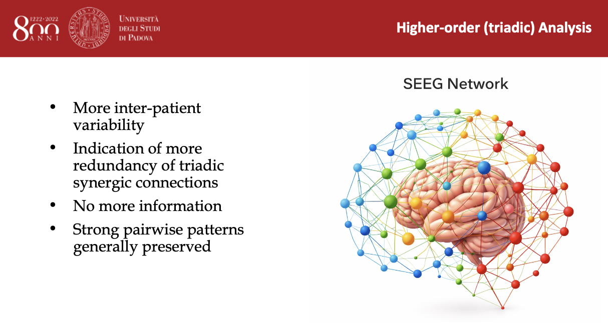
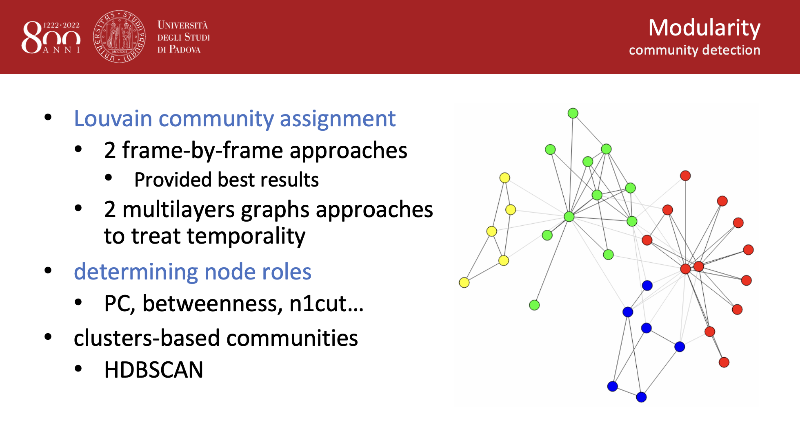
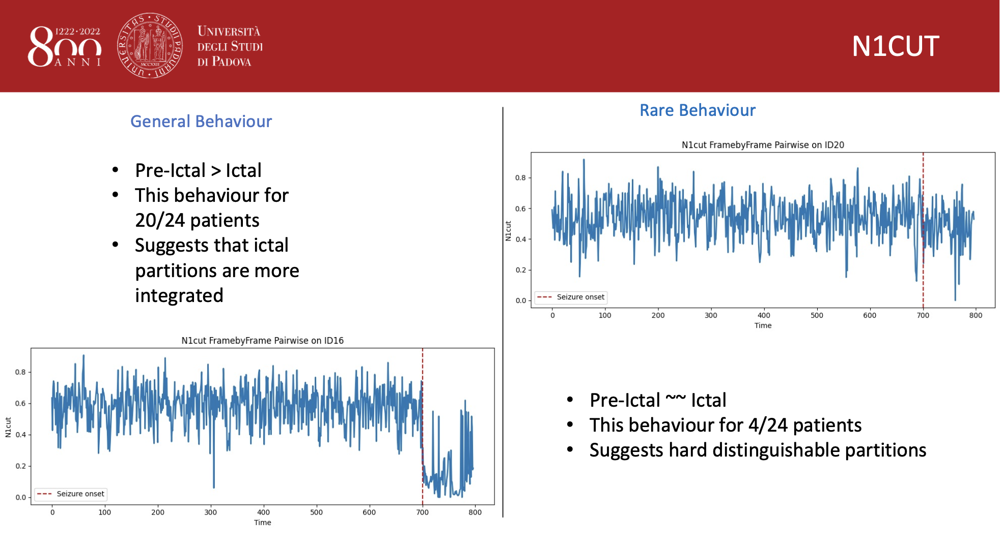

# SEEG Network Analysis & Seizure Prediction

Network science and machine learning applied to intracranial SEEG data for seizure-related brain state analysis.



---

# Overview

This project explores the use of graph-based and higher-order network representations for modelling epileptic brain activity from SEEG recordings.

The work combines:

- Pairwise functional connectivity networks
- Higher-order (triadic / hypergraph-inspired) interactions
- Community detection and clustering techniques
- Machine learning methods for seizure state analysis

The project was developed as part of a Data Science academic research collaboration at the University of Padua.

---

# Main Contributions

## Pairwise SEEG Networks

Construction of weighted brain connectivity networks using:

- Mutual Information
- Dual Total Correlation

---

## Higher-Order Connectivity

Development of triadic interaction structures to model higher-order relationships between SEEG channels.

---

## Community Detection

Analysis of network modular organisation through:

- Louvain community assignment
- Custom N1Cut metric
- Modularity-based approaches
- Node role analysis



---

## N1Cut Analysis

Development and analysis of the custom N1Cut metric for seizure-state network partition evaluation.

Main findings:

- Pre-ictal states generally showed higher N1Cut values than ictal states
- Consistent behaviour observed across most patients
- Results suggest stronger integration during seizure onset



---

## Machine Learning & Clustering

Implementation of:

- HDBSCAN clustering
- Seizure-related state exploration
- Comparative analysis between connectivity representations
- Classification models for seizure-state prediction


---

# Technologies Used

- Python
- NumPy
- pandas
- NetworkX
- scikit-learn
- HDBSCAN
- Matplotlib
- Jupyter Notebook

---

# Results

The project highlights how both pairwise and higher-order network structures can capture meaningful patterns in SEEG brain activity.

The implemented approaches showed consistency between community detection metrics and theoretical expectations regarding seizure-related connectivity dynamics.

Key observations include:

- Strong preservation of pairwise structures
- Increased variability in higher-order representations
- Meaningful clustering behaviour across seizure states
- Promising machine learning performance using graph-derived features

---

# Authors
- Ceron Francesco
- Cavaliero Emanuele
- Bonin Giorgia
- Contiero Filippo

---

# Repository Structure

```bash
.
├── images/
├── notebooks/
├── report/
├── README.md
